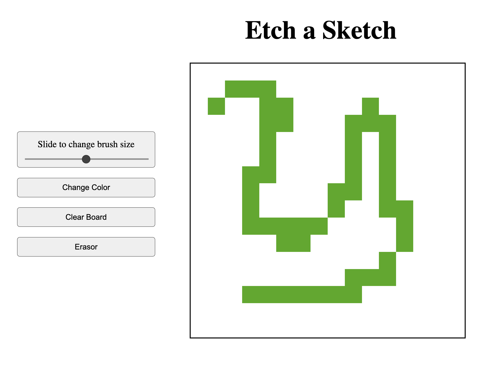
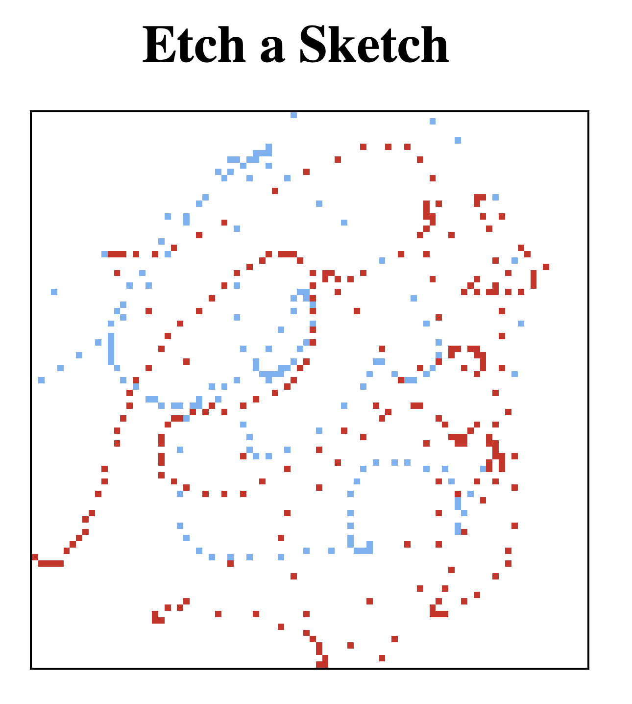

## Etch-A-Sketch

This project creates a basic sketchboard that can be used in the browser. The goal of the project was to review some of my skills through practice.

[](#table-of-contents)

## Overview:

<ul>
    <li>Draw on the sketchboard by hovering with a mouse, no need to click</li>
    <li>Change the size of the paint brush through a slider</li>
    <li>Change the brush color</li>
    <li>Clear the board to start fresh</li>
    <li>Use an erasor to clear only some part of the sketch</li>
</ul>

[](#table-of-contents)

## Project Files:
<ul>
    <li><b>index.html</b>: contains the html tags, DOM setup and related meta information</li>
    <li><b>script.jss</b>: contains the JavaScript code for EventListeners, creation of the sketchboard</li>
    <li><b>style.css</b>: contains the CSS that sets FlexBox, Grid layout, button, slider desing</li>
    <li><b>ReadMe</b>: this document</li>
    <li><b>.gitignore</b> file setup to ignore Mac system files on local machine</li>
    <li>Images used in the project</li>
</ul>

[](#table-of-contents)




[](#table-of-contents)



[](#table-of-contents)

## Revised through this project:
<ul>
    <li>HTML, CSS (UI tricks, common properties, tags)</li>
    <li>JavaScript (DOM manipulation, FlexBox, Grid, Node.JS)</li>
    <li>Git (terminal commands, markup for ReadMe, setup/deployment, Conventional Commits)</li>
    <li>Font Awesome, BootStrap (ended up not utilizing)</li>
</ul>

[](#table-of-contents)

```css
.div {
    display: flex;
    flex: 1 1 5%;
    flex-direction: column;
    flex-wrap: wrap;
}

input[type='range'] {
    -webkit-appearance: none;
    appearance: none;

    &::-webkit-slider-runnable-track {
        cursor: pointer;
        background-color: transparent;
    }

    &::-webkit-slider-thumb {
        height: 2em;
        background-color: rgba(65,65,65);
        border-radius: 1em;
    }
}     
```

```javascript
gridDiv.style.gridTemplateColumns = repeat(gridSize, 1fr);
gridDiv.style.gridTemplateRows = repeat(gridSize, 1fr);
